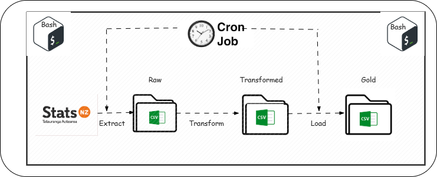
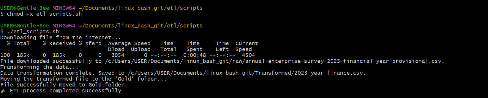
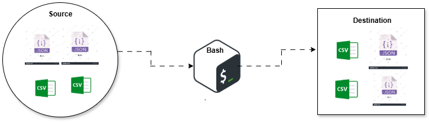
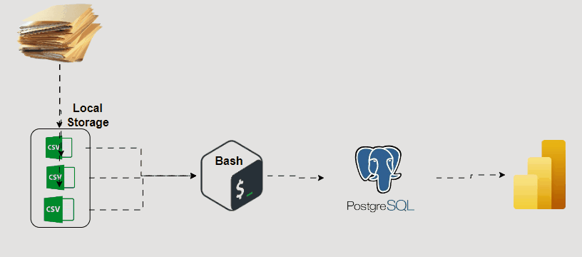
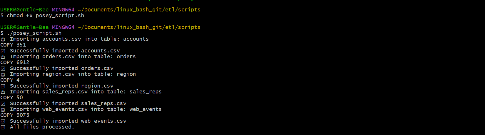

# ETL Data Processing with Linux and Bash Scripting

## Introduction
Data engineering plays a crucial role in the data ecosystem, particularly through its focus on ETL (Extract, Transform, Load) processes. ETL is the backbone of data management, enabling organizations to harness raw data from various sources, transform it into usable formats, and load it into data warehouses or other storage systems for analysis.

In the modern data ecosystem, the volume, velocity, and variety of data continue to grow, making ETL processes more complex yet more essential. Data engineers design, build, and maintain these ETL pipelines, ensuring that data flows smoothly, remains accurate, and is accessible for downstream analytics and decision-making. They work with big data tools, cloud platforms, and databases to automate and optimize these processes, which allows data analysts and data scientists to focus on generating insights rather than wrangling data.

By ensuring data quality, consistency, and availability, data engineers create a solid foundation for all other data-related activities within an organization. Their work enables real-time analytics, machine learning, and business intelligence, making data engineering a vital part of the modern data ecosystem.


## About the Project

The ETL and SQL Project is designed to showcase and practice key skills in data engineering by developing a comprehensive ETL (Extract, Transform, Load) pipeline and performing some SQL tasks using Bash scripts. The project aims to build an efficient and automated data processing workflow, focusing on the extraction of data from various sources, transforming it into a consistent format, and loading it into a destination for further usage by either the data analyst or the data scientist.
This project serves as a practical example of how to manage and manipulate data using common tools and technologies in data engineering like linux operating system, bash scripting, postgresql and git. 


## Aim of the Project
The primary aim of the project is to demonstrate proficiency in creating ETL pipelines and working with SQL databases while using Bash for scripting and automation. This project is intended to provide hands-on experience in managing data workflows and integrating version control practices with Git and GitHub.

## Objective of the project
* Develop an ETL Pipeline: Design and implement a robust ETL pipeline that extracts data from diverse sources, transforms it according to predefined rules, and loads it into a destination.
* Use Bash for Scripting: Utilize Bash scripts to automate various stages of the ETL process, including data extraction, transformation, and loading.
* Apply SQL for Data Management: Write and execute SQL queries to manage and manipulate the data within the database, ensuring data integrity and accessibility.
* Integrate Version Control: Push the entire project to GitHub using Git for version control, facilitating collaboration, documentation, and tracking changes throughout the project lifecycle.

## Key terms, concepts and tools
Let’s take a look at some of the tools and terminologies that we used while working on this project.

* **ETL(Extract, Transform, Load)**: ETL refers to the process of extracting data from various sources, transforming it into a suitable format, and loading it into a data warehouse or database. This process is crucial for integrating data from disparate sources into a unified system for analysis and reporting.

* **Bash: Bash (Bourne Again Shell)** is a Unix shell and command language used for scripting. It allows users to automate repetitive tasks, such as data extraction and transformation, by writing scripts that execute a series of commands.

* **SQL (Structured Query Language)**: SQL is a standard language used for querying and managing relational databases. It enables users to perform operations such as querying, updating, and managing data within a database.
* **Git**: Git is a distributed version control system that tracks changes to files and facilitates collaboration among developers. It allows for branching, merging, and maintaining a history of changes to the project.

* **GitHub**: GitHub is a web-based platform for version control and collaboration, built on top of Git. It provides a repository hosting service where users can share and collaborate on code, track issues, and review changes.

This project not only enhances practical skills in data engineering but also emphasizes best practices in version control and documentation, making it a valuable addition to any data professional's portfolio.

This project presents various case studies, each offering unique challenges. We will explore these case studies and apply the relevant concepts to meet the aims and objectives outlined earlier. Join me on this journey as we work through each case and implement the solutions together.

## Task 1
You have been hired as a new Data Engineer at a CDE. The CDE infrastructure is based on the Linux Operating System. Your manager has tasked you with the responsibility of managing the company’s data infrastructure and version control tool.

Your manager has assigned you the task of building a Bash script (use only bash scripting) that performs a simple ETL process:

**Extract**: Download a CSV file. You can access the CSV using this link. Save it into a folder called raw. Your script should confirm that the file has been saved into the raw folder.

**Transform**: After downloading the file, perform a simple transformation by renaming the column named Variable_code to variable_code. Then, select only the following columns: year, Value, Units, variable_code. Save the content of these selected columns into a file named 2023_year_finance.csv. This file should be saved in a folder called Transformed, your Bash script should confirm that it was loaded into the folder.

**Load**: Load the transformed data into a directory named Gold. Also, confirm that the file has been saved into the folder.

##### *Note: Use environment variables for the URL, and call it in your script. Write a well-detailed script, add sufficient comments to the script, and print out information for each step*.

### Solution 



**ETL Script**:[`etl_scripts.sh`](./etl/scripts/etl_scripts.sh)



## Task 2
Your manager has asked you to schedule the script to run daily using cron jobs. Schedule the script to run every day at 12:00 AM.

### Solution 

For this task, I encountered issues running the cron job using the Git Bash terminal, which led me to switch to WSL with Ubuntu. Git Bash was not compatible with the cron job setup, so using Ubuntu within WSL was necessary to successfully perform this task.

I began by navigating to the scripts directory, where I created a new script file named cron_setup. After installing cron on the system, I wrote a script to set up a recurring job.

Finally, I assigned the necessary permissions to the `cron_setup` script and executed it to ensure the cron job was correctly configured and running as intended.

Below is a simulated example of a cron schedule that would run the ETL script daily at midnight:

```bash
0 0 * * * /home/gentlebee/linux_bash_git/etl/scripts/etl_scripts.sh

```


## Task 3
Write a Bash script to move all CSV and JSON files from one folder to another folder named json_and_CSV. Use any Json and CSV of your choice, the script should be able to work with one or more Json and CSV files.

### Solution
For this case study, the first step was to source the necessary files, which I downloaded from the internet. I ended up with two JSON files and two CSV files.

After downloading the files, I created a directory using a Bash script and moved all the files into that directory. I then navigated to the Bash_Script directory using Git Bash and created a script file named move_csv_json.

Next, I edited the move_csv_json script to write the commands needed to move the files. Once the script was completed, I assigned the appropriate permissions and executed it.
After receiving a confirmation message that the task was performed successfully, I navigated to the json_and_csv directory to verify that all the files had been moved as intended.




** ETL Script**[`download_and_move.sh`](./etl/scripts/download_and_move.sh)


## Task 4
CDE is expanding into the sales of goods and services. To understand the competitive landscape, the company needs to analyze data from one of its key competitors, Parch and Posey. The analysis involves downloading and processing their data. Follow the steps below to achieve this:
Part 1: Automate Data Ingestion with Bash Script
Objective: Write a Bash script to iterate over and import CSV files into a PostgreSQL database named posey.

### Solution:
First, I downloaded the provided CSV files onto my local machine.
I created a configuration file (database.conf) to store my database credentials, which helped in securely handling the connection details.
Next, I created a script named posey_scripts.sh and wrote the Bash logic to iterate over each CSV file and import it into the PostgreSQL database. This script was well-documented to ensure clarity.

**Script**[`posey_script.sh`](./etl/scripts/posey_script.sh)



### Part 2: SQL Queries for Data Analysis
Write SQL scripts to answer specific questions posed by the manager 

*Find a list of order IDs where either gloss_qty or poster_qty is greater than 4000. Only include the id field in the result.
``` sql
SELECT id FROM orders 
WHERE gloss_qty > 4000 OR poster_qty > 4000
```
* Write a query that returns orders where the standard_qty is zero and either the gloss_qty or poster_qty is over 1000.
``` sql
SELECT * FROM orders 
WHERE standard_qty = 0 AND (gloss_qty > 100 OR poster_qty > 100)
```
* Find all company names that start with 'C' or 'W' and where the primary contact contains 'ana' or 'Ana', but does not contain 'eana'.
``` sql
SELECT name
FROM accounts
WHERE (name LIKE 'C%' OR name LIKE 'W%')
  AND (primary_poc LIKE '%ana%' OR primary_poc LIKE '%Ana%')
  AND primary_poc NOT LIKE '%eana%'
```
* Provide a table that shows the region for each sales rep, along with their associated accounts. The table should include three columns: the region name, sales rep name, and account name. Ensure the account names are sorted alphabetically.
``` sql
SELECT s_rep.name AS sales_rep, rgn.name AS region, acct.name AS account_name 
FROM sales_reps AS s_rep
LEFT JOIN region AS rgn 
	ON s_rep.region_id = rgn.id
RIGHT JOIN accounts AS acct 
	ON acct.sales_rep_id = s_rep.id
ORDER BY account_name
```


